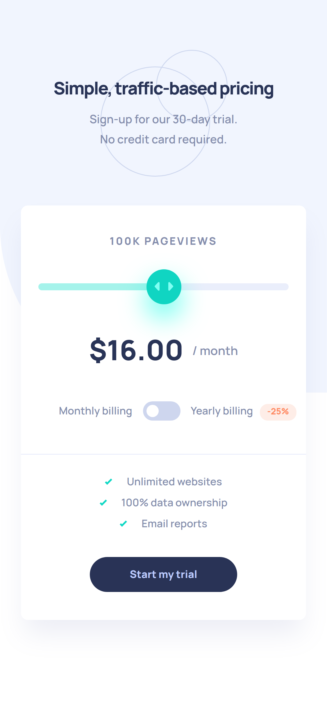
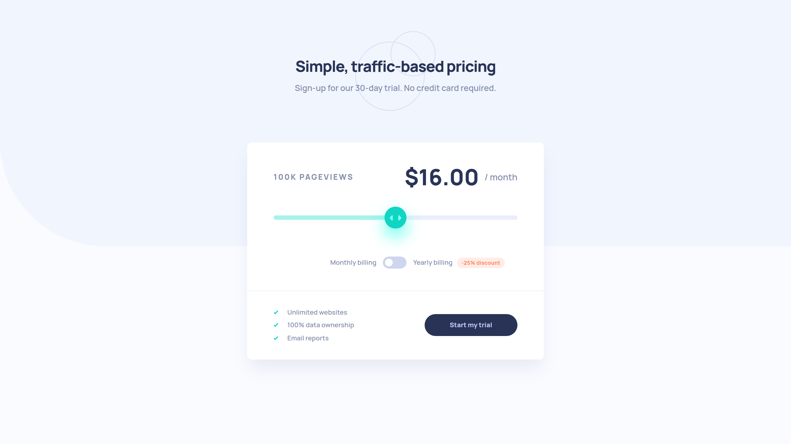

# Frontend Mentor - Interactive pricing component solution

This is a solution to the [Interactive pricing component challenge on Frontend Mentor](https://www.frontendmentor.io/challenges/interactive-pricing-component-t0m8PIyY8). Frontend Mentor challenges help you improve your coding skills by building realistic projects. 

## Table of contents

- [Overview](#overview)
  - [The challenge](#the-challenge)
  - [Screenshot](#screenshot)
  - [Links](#links)
- [My process](#my-process)
  - [Built with](#built-with)
  - [What I learned](#what-i-learned)
  - [Continued development](#continued-development)
  - [Useful resources](#useful-resources)
- [Author](#author)
- [License](#license)

## Overview

### The challenge

Users should be able to:

- View the optimal layout for the app depending on their device's screen size
- See hover states for all interactive elements on the page
- Use the slider and toggle to see prices for different page view numbers

### How to build

This project uses Parcel bundler, so building only takes a few steps!

Clone the repository:
```sh
$ git clone https://github.com/elidrissidev/interactive-pricing-component.git
```

Install the dependencies with Yarn (`npm i -g yarn` to install yarn):

```sh
$ yarn install
```

Start the development server:
```sh
$ yarn start
```

Or, build the website for production:
```sh
$ yarn build
```

### Screenshot

| Mobile (375px) | Desktop (1440px) |
| --- | --- |
|  |  |

### Links

- [Solution URL](https://www.frontendmentor.io/solutions/interactive-pricing-component-kFKG_ss6-)
- [Live Site URL](https://interactive-pricing-component-elidrissidev.vercel.app/)

## My process

### Built with

- Semantic HTML5 markup
- CSS custom properties
- Flexbox
- Mobile-first workflow
- [Parcel](https://parceljs.org/)

### What I learned

This was my first time styling a native `input[type="range"]`, and it was not straightforward because of the different prefixes required for all browsers. This is also the first challenge I do with a PRO subscription, so I tried to make the implementation look as close as possible and I'm happy about the result!

### Useful resources

- [Building Inclusive Toggle Buttons](https://www.smashingmagazine.com/2017/09/building-inclusive-toggle-buttons/) - This helped me understand how to build accessible toggle buttons using only the native `button` element!.
- [A Sliding Nightmare: Understanding the Range Input](https://css-tricks.com/sliding-nightmare-understanding-range-input/) - This great article from CSS Tricks goes deep into the range input and how to customize it in all the major browsers.

## Author

- Website - [Mohamed ELIDRISSI](https://www.elidrissi.dev)
- Frontend Mentor - [@elidrissidev](https://www.frontendmentor.io/profile/elidrissidev)

## License

This project is licensed under the [MIT License](LICENSE.txt).
